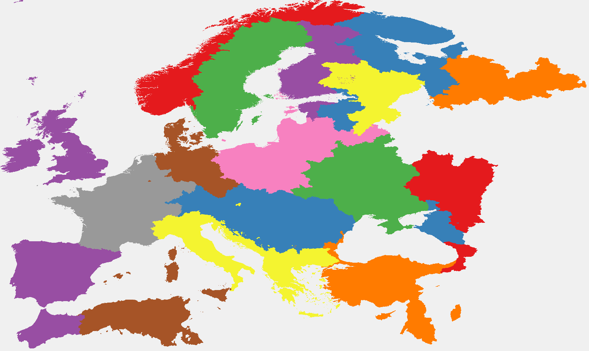

# Domain landmask generation
This tool is developed to generate landmasks, split into seperate stand-alone domains, based on a local drainage direction map at any resolution. Moreover, domain landmasks are generated for user-defined regions (i.e. not only global). These regions are defined based on (1) a single point, in which case the river basin this point belongs to is selected or (2) an area extent, in which case all river basins whos outlets are located in the extent are selected. In generating these domain landmasks, three factors are taken into account:

1. River basins whos outlets are located within the same delta should be within the same domain
2. Domains should be no larger than the largest domain after step 1
2. River basins whos outlets are located within the same country should be within the same domain as much as possible
3. River basins whos outlets are near to each other should be within the same domain as much as possible

As an example the below figure shows the domain division for an 30 arc-seconds European region. Note that the landmasks for each domain are reported on the extent of their bounding box.

## Usage
The scripts should be run in the following order:

1. make_catchments.py: creates a global catchments map at the ldd resolution. Catchmets are defined by the ldd.
2. make_deltas.py: creates a global delta map at the ldd resolution. Deltas are expanded by a (user-defined) distance.
3. make_delta_catchments.py: creates a global catchments map where river basin outlets within the same delta are combined.
4. make_region_detla_catchments.py: creates regions based on (user-defined) points or areas and reports the delta-catchments and ldd at the region's bouding box.
5. make_region_countries.py: creates region country maps at the ldd resolution. Countires are expanded to fill the ldd mask.
6. make_region_country_catchments: creates region catchments maps where river basin outlets within the same country are combined as much as possible. Combining stops if the combined size is larger than the largest catchment in the region.
7. make_region_combined_catchments: creates region catchment maps where river basin outlets close to one another ar combined as much as possible. Combining stops if the combined size is larger than the largest catchment in the region.
8. split_region_domains.py: creates region landmask maps for each combined catchment domain at the domain's bouding box.

## Requirements
* Scripts require Python and several Python packages. An environment file for setting up the correct conda environment is provided in 'environment.yml'.

* Global data on deltas, country borders and ldds should be provided in the input folder. Delta and country border shape files can be found at [Deltas at Risk](https://www.globaldeltarisk.net/data.html) (Tessler et al., 2015) and [geoBoundaries](https://www.geoboundaries.org/globalDownloads.html) (Runfola et al. 2020) respectively. Ldd's are user-defined and should be provided in the pcraster format.

## Caveats
* Scripts have not yet been tested at the global extent

* Here, catchments are combined by country, but for other cases (e.g. US, India or China) one could also use states. All scripts should work as long as the states are available as a shape file.

* There can be (very) small areas within a larger catchment that are allocated towards another domain, as the domain for the larger catchment has already reached its maximum size. This results in cases where (1) the domain for the larger catchment to have some holes and (2) cause some domains to have a large spatial extent only to incorporate some few cells at its edges.

## References
Tessler, Z.D. et al. (2015) Profiling Risk and Sustainability in Coastal Deltas of the World. Science 349(6248), 638-643. https://doi.org/10.1126/science.aab3574.

Runfola, D. et al. (2020) geoBoundaries: A global database of political administrative boundaries. PLoS ONE 15(4): e0231866. https://doi.org/10.1371/journal.pone.0231866